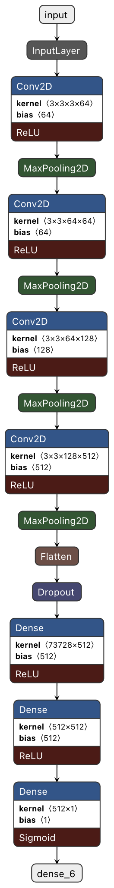

# Predict Malignant and Benign Skin Moles 

skin cancer is one of the leading causes of cancer-related deaths on this planet. Often it can be prevented by going regularly to the dermatologist. Unfortunately, this is often neglected by various people until it's too late.
Let's create some machine learning models that might help to diagnose early stages of melanoma.

Dataset has 2 different classes of skin cancer which are listed below :
1. Benign 
2. Malignant 

In this Notebook I will try to detect 2 different classes of moles using Convolution Neural Network with keras tensorflow in backend and then analyse the result to see how the model can be useful in practical scenario.

You can Download the dataset at [kaggle](https://www.kaggle.com/fanconic/skin-cancer-malignant-vs-benign) 

### My Model Architecture  

## Requirements 
***

To run the notebook You will need 
> Tensorflow

